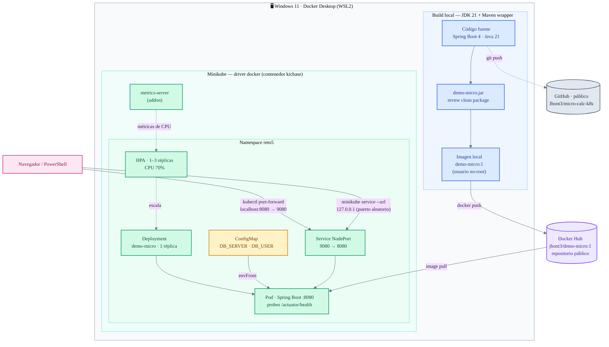

# micro-calc-k8s

Microservicio calculadora (Spring Boot) containerizado y desplegado en Kubernetes vía Minikube. Entregable del **Reto 5 — Docker, Docker Hub y Despliegue en Minikube sobre Windows** (Diplomado, Módulo 5).

Basado en [gmacastil/micro-calc](https://github.com/gmacastil/micro-calc), traducido a inglés (código, clases, endpoints) y adaptado para Docker + Kubernetes + Minikube en Windows.

## Sobre este repositorio

Este repositorio se creó desde cero a partir del proyecto base — no como fork nativo de GitHub, ya que GitHub no permite forks privados de repositorios públicos y el trabajo se desarrolló en privado hasta la entrega (ahora es **público** para su revisión). Ver [`docs/adr/adr-0001-private-repo-instead-of-fork.md`](docs/adr/adr-0001-private-repo-instead-of-fork.md) para el detalle de esta decisión.

## Arquitectura

Ciclo completo: build local → publicación en Docker Hub → despliegue en Minikube → acceso desde el host (detalle y explicación de cada flujo en [`docs/architecture.md`](docs/architecture.md)):



## Endpoints

| Endpoint | Descripción |
|---|---|
| `GET /add/{a}/{b}` | Suma `a + b` |
| `GET /subtract/{a}/{b}` | Resta `a - b` |
| `GET /divide/{a}/{b}` | División `a / b` (maneja división por cero con un mensaje de error en vez de fallar) |
| `GET /` | Muestra la configuración externa activa (`db.user`, `db.server`) — útil para comprobar que el ConfigMap de Kubernetes está siendo usado en vez de los valores por defecto del jar |
| `GET /actuator/health` | Health check de Spring Boot Actuator, usado por los probes de Kubernetes |

## Metodología

Este proyecto sigue un flujo de *spec-driven development* ligero, sin depender de un framework externo:

- [`docs/spec.md`](docs/spec.md) — requisitos funcionales/no funcionales y criterios de aceptación, derivados 1:1 del checklist del reto.
- [`docs/plan.md`](docs/plan.md) — plan de implementación por fases.
- [`docs/adr/`](docs/adr/) — Architecture Decision Records documentando las decisiones que se desvían del proyecto de referencia `equipos` (mismo diplomado): repositorio privado en vez de fork, Service `NodePort` en vez de `ClusterIP`, traducción del código a inglés, y carpeta `k8s/` en la raíz.

## Requisitos

- JDK 21
- Docker Desktop (con backend WSL2 habilitado)
- kubectl
- Minikube

## Build y ejecución local

```powershell
.\mvnw.cmd clean package -DskipTests
docker build . -t demo-micro:1
docker run --name demo-micro1 -d -p 8080:8080 demo-micro:1
```

Probar:

```powershell
Invoke-RestMethod http://localhost:8080/add/5/3
Invoke-RestMethod http://localhost:8080/subtract/10/4
Invoke-RestMethod http://localhost:8080/divide/8/0
Invoke-RestMethod http://localhost:8080/
Invoke-RestMethod http://localhost:8080/actuator/health
```

## Publicar en Docker Hub

```powershell
docker tag demo-micro:1 <tu-usuario-dockerhub>/demo-micro:1
docker login
docker push <tu-usuario-dockerhub>/demo-micro:1
```

## Desplegar en Minikube

```powershell
minikube start --driver=docker --cpus=2 --memory=4000
kubectl config current-context   # debe decir "minikube"
kubectl apply -f k8s/            # el namespace reto5 se crea automáticamente (00-namespace.yaml aplica primero)
kubectl get pods,svc -n reto5
```

Si se va a usar el HPA opcional, habilitar antes el addon de métricas:

```powershell
minikube addons enable metrics-server
```

Probar (recomendado — funciona sin importar el driver de Minikube):

```powershell
kubectl port-forward svc/demo-micro 8080:9080 -n reto5
```

Y en otra terminal, repetir las mismas pruebas de arriba contra `http://localhost:8080`. El endpoint `/` debería mostrar ahora los valores del ConfigMap (`admin-k8s,postgres-k8s.reto5.svc.cluster.local`), no los valores por defecto del jar (`admin,localhost`) — la prueba más simple de que la configuración externalizada realmente funciona.

Bono:

```powershell
minikube service demo-micro -n reto5 --url
minikube dashboard
```

## Estructura

```
├── Dockerfile
├── .dockerignore
├── micro-calc.http       # set de peticiones de prueba (REST Client / IntelliJ HTTP)
├── k8s/                  # manifiestos de Kubernetes (raíz, no anidados)
│   ├── 00-namespace.yaml # namespace reto5 (aplica primero por orden alfabético)
│   ├── configmap.yaml
│   ├── deployment.yaml
│   ├── service.yaml
│   └── hpa.yaml          # opcional, requiere "minikube addons enable metrics-server"
├── docs/
│   ├── spec.md
│   ├── plan.md
│   ├── REPORTE.md        # reporte de avance / base del PDF final
│   ├── architecture.md   # diagrama de arquitectura (Mermaid)
│   ├── capturas/         # capturas de pantalla de las evidencias
│   ├── Reto5_Evidencias_Jhonatan_Escobar.pdf   # PDF final del reto
│   └── adr/
└── src/                  # código fuente (en inglés)
```
