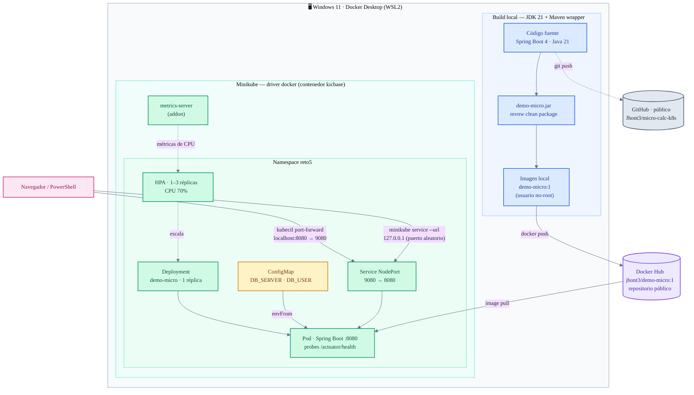

# Arquitectura — micro-calc-k8s

Vista completa del ciclo: build local → publicación en Docker Hub → despliegue en Minikube → acceso desde el host.

> **Para verlo en VS Code:** abrir este archivo y presionar `Ctrl+Shift+V` (vista previa de Markdown). Requiere la extensión *Markdown Preview Mermaid Support* (`bierner.markdown-mermaid`).

## Flujos

1. **Build (azul):** el código se compila con el Maven wrapper sobre JDK 21; el jar resultante se empaqueta en la imagen `demo-micro:1` con usuario no-root.
2. **Publicación (violeta):** la imagen se etiqueta y sube a Docker Hub como `jhont3/demo-micro:1` (pública — el cluster puede jalarla sin `imagePullSecrets`).
3. **Despliegue (verde):** el Deployment en el namespace `reto5` crea el Pod; el kubelet de Minikube jala la imagen **desde Docker Hub**, no desde el daemon local — prueba de que la imagen publicada funciona por sí sola.
4. **Configuración (ámbar):** el ConfigMap inyecta `DB_SERVER`/`DB_USER` como variables de entorno (`envFrom`); el endpoint `/` los expone, demostrando la configuración externalizada frente a los defaults del jar.
5. **Acceso (rosa):** dos rutas desde el host — `kubectl port-forward` (principal, determinística) y el túnel de `minikube service --url` (bono; bajo el driver docker en Windows la IP del nodo no es alcanzable directamente, por eso el Service es NodePort — ver ADR-0002).
